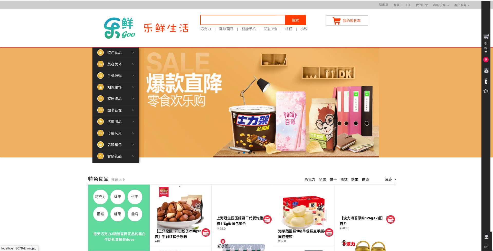
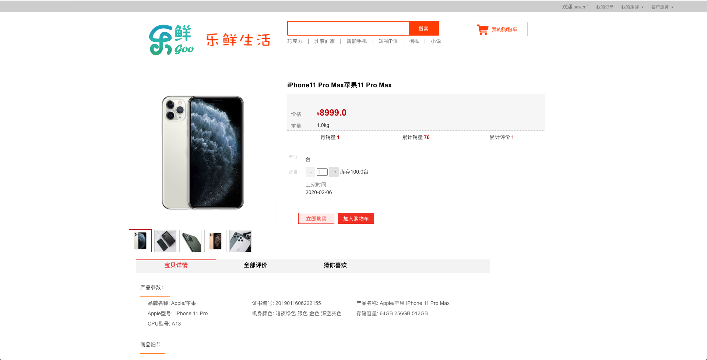
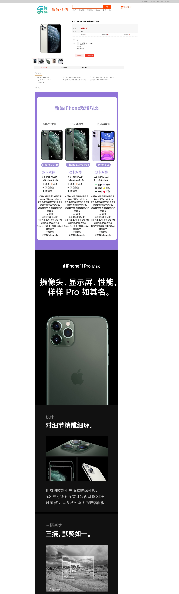
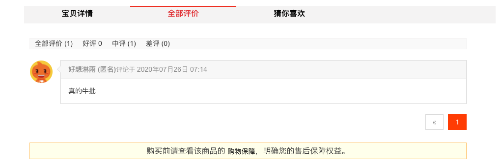
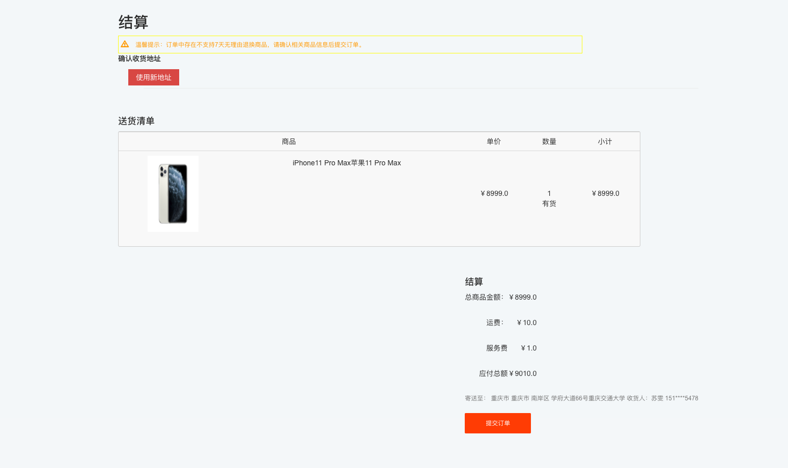
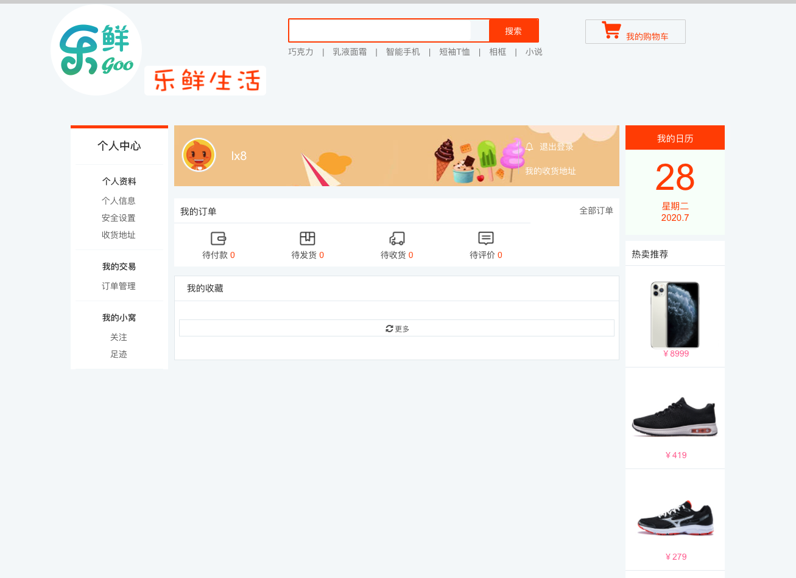
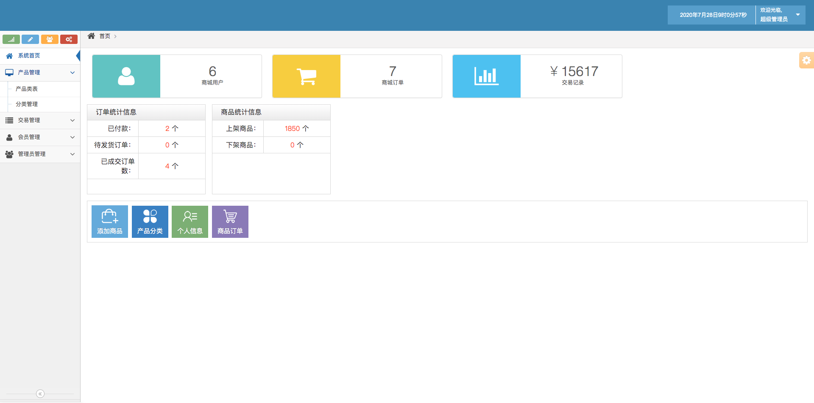

# 乐鲜生活（LexianLife）

---
- [1.概述](#1.概述)
- [2.技术栈](#2.技术栈)
- [3.实现功能](#3.实现功能)
- [4.使用方法](#4.使用方法)
- [5.注意事项](#5.注意事项)
- [6.项目演示](#6.项目演示)
---
## 1.概述

本仓库为“乐鲜生活”电子商务系统实训项目,“乐鲜生活”是一个 B2C 生活消费类电子商务平台。
该平台采用基于“网站订购-门店 取货”的购物模式:“乐鲜生活”网站管理和维护着所有代售商品，并提供消费者统一的浏览、购物、下单、支付功能;
遍布于各地的线下门店为消费者提供上门取货服务。
鉴于电子商务平台的复杂性，完整的系统将分为 2~3 期逐步建设。本仓库仅阐述项目第一期即电子商务基本功能平台的需求，
主要包括:
1. 供消费者购物和下单的购物客户端
2. 供商城运营人员进行后台管理的信息管理系统
> [详细需求文档](https://suwen.lanzous.com/inwzdf1ws7i)

## 2.技术栈

* SpringBoot
* SpringMVC
* Hibernate
* MySQL
* JSP
* Tomcat
* ...

本仓库是从 SpringMVC 迁移至 SpringBoot, 故使用 JSP(Spring 官方已经不推荐使用), 原仓库为 [LexianLife-spring](https://github.com/EslSuwen/LexianLife/tree/spring).

## 3.实现功能
* 顾客：用户注册、登录、登出、修改信息、地址管理、关注商品、浏览记录..
* 商品：商品详请、商品分类、商品评论..
* 管理员：管理员信息管理、顾客管理、商品管理、订单管理..
...
> 尚存在问题的功能均以 TODO 标识

## 4.使用方法

IntelliJ IDEA（或其他编译工具）
1. Sql 导入数据库中
2. 将项目导入到 IntelliJ IDEA 中，然后利用 Maven 工具导入 jar。
3. 修改项目中的数据库连接名及用户验证。
4. 启动项目,即可浏览系统。

## 5.注意事项

1. 项目迭代冗余文件较多，clone 时请加参数 『--depth=1』。
2. 项目图片资源较多，单独放在云盘，配合 SQL 可另作他用。
> [图片资源](https://pan.baidu.com/s/1iColsjsomMS19LrXZfmAWw)
> 密码: 6pon

## 6.项目演示

[演示地址](http://47.107.239.108:8079/)

*主页*

*商品*

*商品详请*

*商品评论*

*商品购买*

*顾客主页*

*管理员主页*

